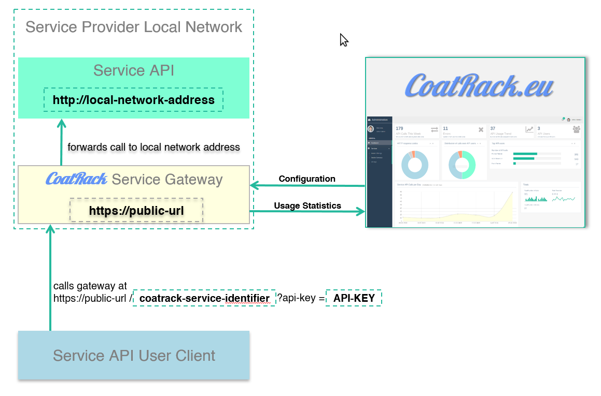

# CoatRack

CoatRack is an API gateway management framework that supports:

* Monitoring APIs calls
* Authentication/Authorization of API calls
* Monetization of APIs

CoatRack consists of:

* Distributed, lightweight API gateways
* A centralized web application to generate and manage the API gateways.

## Contents

* [Background](#background)
* [Install](#install)
* [Usage](#usage)
* [License](#license)

## Background

In case a company/organization would like to offer services to third parties in the form of REST APIs, a lot of additional work is usually required in addition to developing the actual API, e.g. implementing mechanisms for authentication/authorisation, providing access credentials to the users, monitoring calls to the API, generating statistics.

CoatRack facilitates these general tasks by providing an API gateway management framework, consisting of distributed, lightweight API gateways and a centralized web application to generate and manage the API gateways. 

The following figure shows a typical architecture. The calls to a software service API are routed and logged by a custom CoatRack Gateway, which can be install in the service provider's local network. Configuration and statistics are accessible via the CoatRack website.



## Install

Scripts for building and running CoatRack are available in the root folder of the code base. To build CoatRack, use:

```console
./build.sh
```
To run the CoatRack web application, use:

```console
./run-admin-application.sh
```
After starting up, the CoatRack web application will be accessible at `http://localhost:8080` 

## Usage

To start using CoatRack: 

- either run the admin application locally, as explained in the [Install](#install) section
- or open the public instance available at `https://coatrack.eu`.

To log-in to CoatRack, a Github account is required. After logging in and filling in the registration form, the CoatRack admin application will open. Use the "Getting started tutorials" that are accessible from inside the application to learn the basics of using CoatRack.

There are two tutorials inside the application:

- Offering service APIs via CoatRack
- Using service APIs offered via CoatRack

## License

CoatRack is licenced under [Apache 2.0 License](./LICENSE).

© 2013 - 2020 Corizon | Institut für angewandte Systemtechnik Bremen GmbH (ATB)
